## Run Salt Command Locally

- Salt komentoja voi ajaa paikallisesti
- Samat komennot toimivat Windowsilla ja Linuxilla
- Tärkeimmät tilafunktiot ovat pkg, file, service, user ja cmd.
- Saltia käytetään yleensä usean tietokoneen hallintaan verkossa

###### Lähde:

Run Salt Command Locally. Terokarvinen.com. Luettavissa: https://terokarvinen.com/2021/salt-run-command-locally/. Luettu: 31.3.2024.

## Create a Web Page Using Github

- Githubilla voi julkaista nettisivuja helposti ja nopeasti
- Ensin tarvitaan tunnus Githubiin
- Sitten luodaan uusi repositorio
- Repositorioon voi luoda esimerkiksi mark down tiedoston
- Tämän jälkeen nettisivu on julkaistu

###### Lähde:

Create a Web Page Using Github. Terokarvinen.com. Luettavissa: https://terokarvinen.com/2023/create-a-web-page-using-github/. Luettu: 31.3.2024.

## Raportin kirjoittaminen

- Raportin tulee olla täsmällinen ja helppolukuinen
- Lähteet tulla olla merkitty raporttiin
- Luvaton kopiointi loukkaa tekijänoikeuksia

###### Lähde:

Raportin kirjoittaminen. Terokarvinen.com. Luettavissa: https://terokarvinen.com/2006/06/04/raportin-kirjoittaminen-4/. Luettu: 31.3.2024.

# Salt

Asensin Saltin koneelleni osoitteesta: https://docs.saltproject.io/salt/install-guide/en/latest/topics/install-by-operating-system/windows.html#install-windows.

Testasin Saltin toimivaksi ajamalla Powershellissä pääkäyttäjänoikeuksin komennon:

    salt-call --local grains.items

Tämä palautti listan järjestelmän ominaisuuksia.

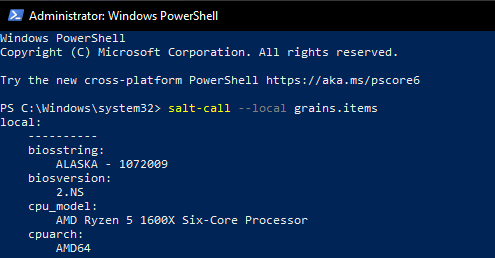

# Vagrant

Asensin Vagrantin osoitteesta: https://developer.hashicorp.com/vagrant/install?product_intent=vagrant.

Kokeilin asentaa uutta virtuaalikonetta Vagrantilla komentokehoitteessa pääkäyttäjänoikeuksin komennolla:

    vagrant init debian/bullseye64

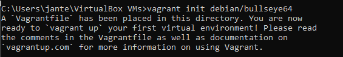

Tämän jälkeen käynnistys komennolla:

    vagrant up

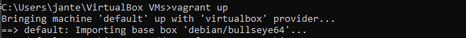

Ja SSH yhteys koneeseen:

    vagrant ssh

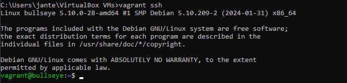

Luotu virtuaalikone ilmestyi VirtualBoxiin.

## Salt asennus uuteen virtuaalikoneeseen

Päivitin ensin paketinhallinnan komennolla:

    sudo apt-get update

Tämän jälkeen saltin asennus komennolla:

    sudo apt-get -y install salt-minion

Tarkistetaan, että salt asentui komennolla:

    sudo salt-call --version

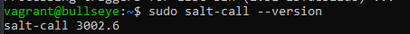

### pkg

    sudo salt-call --local -l info state.single pkg.installed tree

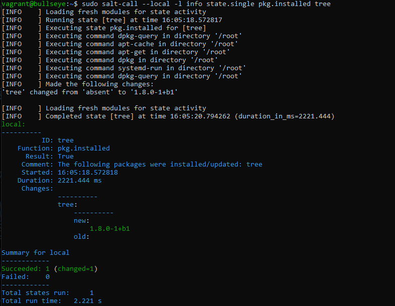

Komento asensi koneelle tree:n, jos sitä ei jo ollut asennettuna. Tämä listaa tiedostohakemiston puumaisessa formaatissa.

### file

    sudo salt-call --local -l info state.single file.managed /tmp/hellotero

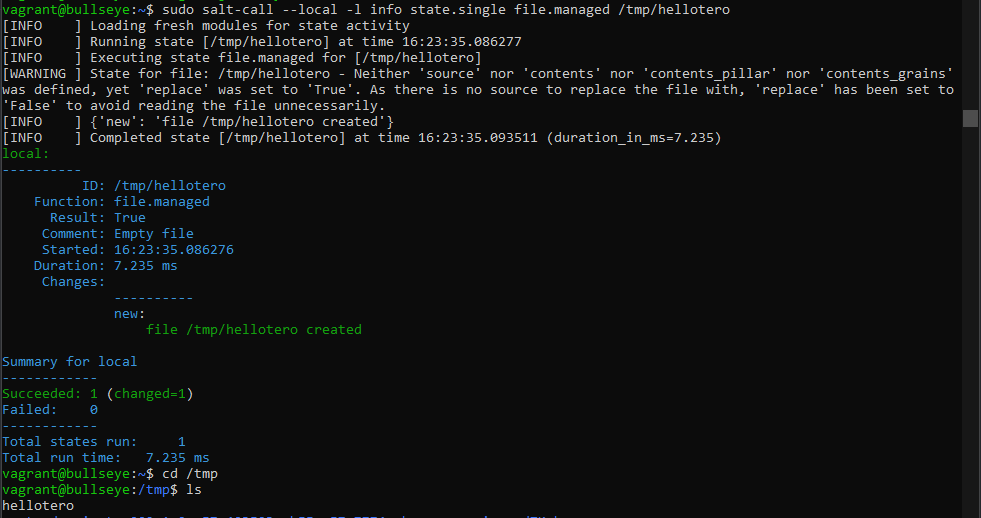

Komento loi tekstitiedoston "hellotero" kansioon /tmp/

### service

    sudo salt-call --local -l info state.single service.running apache2 enable=True

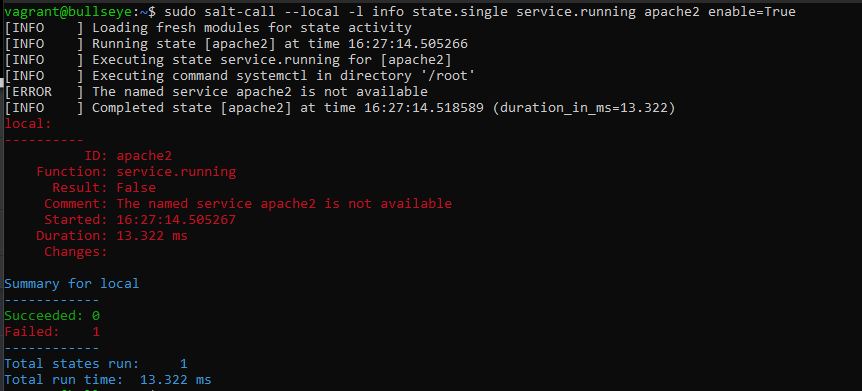

Tätä toimintoa, service.running, käytetään usein käynnistämään daemon automaattisesti uudelleen, kun asetuksia tulee muuttaa.

Virtuaalikoneella ei ollut asennettuna apache2:sta, niin tämä palautti "virheen".

### user

    sudo salt-call --local -l info state.single user.present terote08

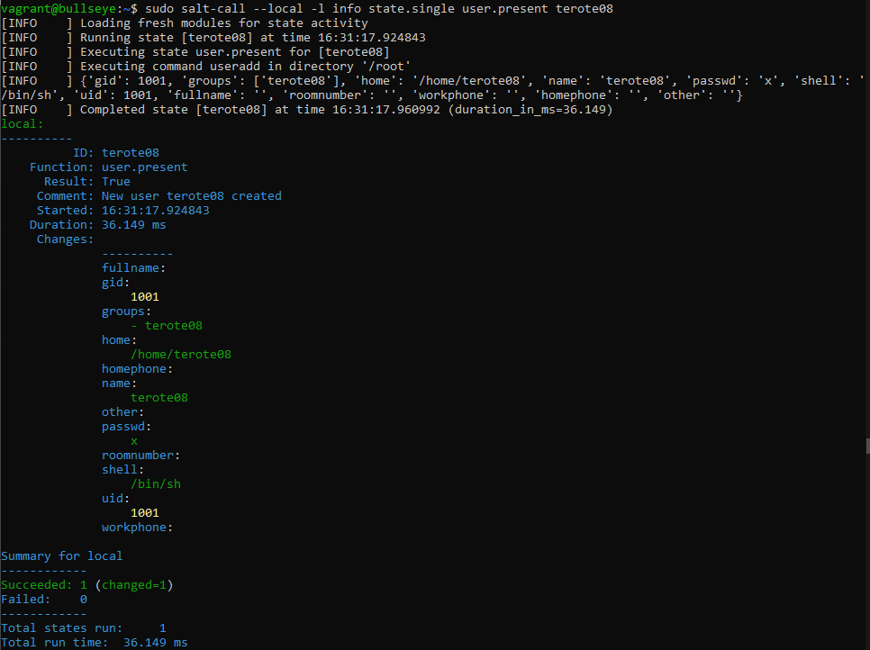

Komento tarkisti, onko käyttäjää "terote08", jos ei, sellainen luotiin.

Jos käyttäjä on jo olemassa, komento palauttaa tiedot:

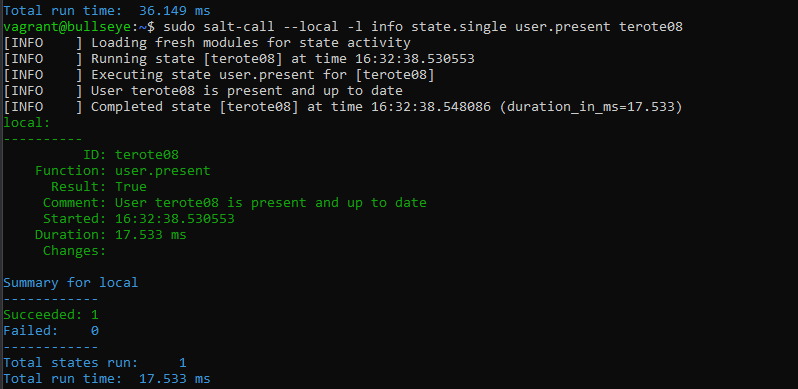

### cmd

    sudo salt-call --local -l info state.single cmd.run 'touch /tmp/foo' creates="/tmp/foo"

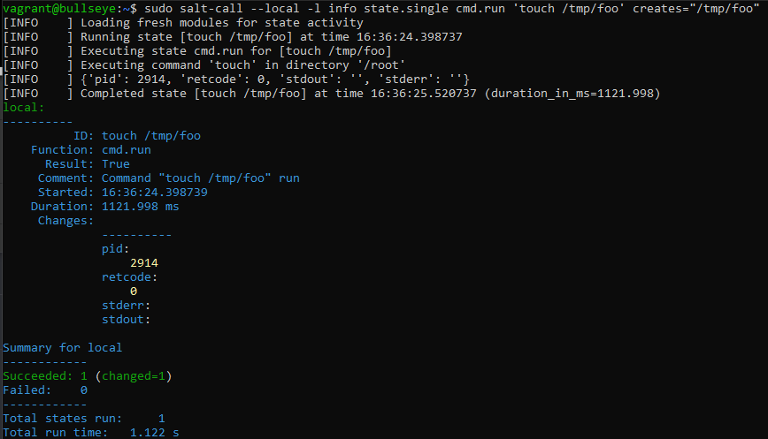

Komento loi tiedoston "foo" kansioon /tmp

## Idempotentti

    salt-call --local

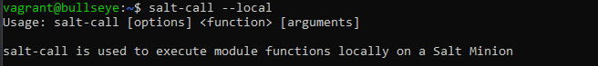

Esimerkiksi:

    sudo salt-call --local grains.item osfinger

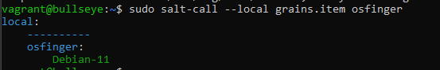

Palauttaa tiedon käyttöjärjestelmästä.

    sudo salt-call --local grains.item osfinger virtual

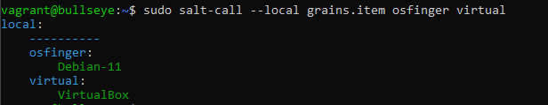

Palauttaa tiedon myös virtuaalikoneesta

###### Lähteet

Create a Web Page Using Github. Terokarvinen.com. Luettavissa: https://terokarvinen.com/2023/create-a-web-page-using-github/. Luettu: 31.3.2024.

Infra as Code - Palvelinten hallinta 2024. Terokarvinen.com. Luettavissa: https://terokarvinen.com/2024/configuration-management-2024-spring/. Luettu: 31.3.2024.

Install Vagrant. Luettavissa: https://developer.hashicorp.com/vagrant/install?product_intent=vagrant. Luettu: 31.3.2024.

Raportin kirjoittaminen. Terokarvinen.com. Luettavissa: https://terokarvinen.com/2006/06/04/raportin-kirjoittaminen-4/. Luettu: 31.3.2024.

Run Salt Command Locally. Terokarvinen.com. Luettavissa: https://terokarvinen.com/2021/salt-run-command-locally/. Luettu: 31.3.2024.

Salt install guide. Salt project. Luettavissa: https://docs.saltproject.io/salt/install-guide/en/latest/topics/install-by-operating-system/windows.html#install-windows. Luettu: 31.3.2024.
