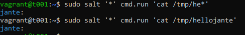

# x) Lue ja tiivistä

## Two Machine Virtual Network With Debian 11 Bullseye and Vagrant

- Kaksi virtuaalikonetta samaan verkkoon Vagrantilla
- Uuden kansion luonti projektille
- Vagrant tiedoston tallennus kansioon
- Tiedostossa määritellään koneet ja niiden IP osoitteet
- Vagrantilla on helppo poistaa luodut koneet ja aloittaa alusta

###### Lähde

Two Machine Virtual Network With Debian 11 Bullseye and Vagrant. Terokarvinen.com. Luettavissa: https://terokarvinen.com/2021/two-machine-virtual-network-with-debian-11-bullseye-and-vagrant/. Luettu: 6.4.2024.

## Salt Quickstart – Salt Stack Master and Slave on Ubuntu Linux

- Saltilla pystyy hallitsemaan useita koneita
- Verkossa on yksi masteri -kone
- Muut koneet ovat "minioneita"
- Master koneella hallitaan minion koneita

###### Lähde

Salt Quickstart – Salt Stack Master and Slave on Ubuntu Linux. Terokarvinen.com. Luettavissa: https://terokarvinen.com/2018/salt-quickstart-salt-stack-master-and-slave-on-ubuntu-linux/?fromSearch=salt%20quickstart%20salt%20stack%20master%20and%20slave%20on%20ubuntu%20linux. Luettu: 6.4.2024.

## Hello Salt Infra-as-Code

- Modulen asennus minion koneille
- Module kansioon luodaan tekstitiedosto
- Tiedosto kirjoitetaan Saltin omalla koodikielellä

###### Lähde

Hello Salt Infra-as-Code. Terokarvinen.com. Luettavissa: https://terokarvinen.com/2024/hello-salt-infra-as-code/. Luettu: 6.4.2024.

# a) Asenna kaksi virtuaalikonetta samaan verkkoon

HOST OS: Windows Version 22H2 (OS Build 19045.4170)

Avasin komentokehoitteen pääkäyttäjän oikeuksin.

Tein ensin kansion projektille, johon lähden asentamaan Vagrantilla uudet virtuaalikoneet. 

Ajoin komennon:

    vagrant init

Tämä loi kansioon "Vagrantfile" tiedoston. Avasin tiedoston Windowsin notepadilla, jossa muokkasin tiedoston sisällöksi konfiguraation, joka oli Tero Karvisen ohjeessa: https://terokarvinen.com/2021/two-machine-virtual-network-with-debian-11-bullseye-and-vagrant/

Tämän jälkeen vagrantin käynnistys ja koneiden asennus konfiguraation mukaan komennolla:

    vagrant up

Tämä komento loi kaksi virtuaalikonetta t001 ja t002

Koneet ilmestyivät näkyviin myös VirtualBoxissa

Kokeilin ottaa ssh yhteyden koneeseen t001:

    vagrant ssh t001

Onnistui:

Kokeilin pingata koneelta ensin Googlen nimipalvelua, joka vastasi onnistuneesti. Tämän jälkeen kokeilin pingata t002:sta, joka myös vastasi pingiin.

Tästä päättelin, että koneet on nyt onnistuneesti samassa verkossa. Kokeilin kuitenkin vielä varmuudeksi ottaa ssh yhteyden t002 koneeseen ja pingata sieltäkin.

Ensin "exit" komennolla poistuminen ja ssh koneelle t002

    vagrant ssh t002

Myös tältä koneelta onnistui ping Googleen sekä t001:seen.

# b) Asenna Saltin herra-orja arkkitehtuuri toimimaan verkon yli

Käytän juuri asentamiani virtuaalikoneita tässä tehtävässä. Asennan t001 koneen Salt masteriksi ja teen t002:sta Salt minion koneen.

Otin ssh yhteyden t001:seen ja asensin Masterin:

    vagrant ssh t001

    sudo apt-get update

    sudo apt-get install salt-master -y

Seuraavaksi otin ssh yhteyden t002:seen ja asensin Minionin

    vagrant ssh t002

    sudo apt-get update

    sudo apt-get install salt-minion -y

Seuraavaksi määrittelin Minion koneella Masterin:

    sudoedit /etc/salt/minion

Muokkasin tiedostoon master kohtaan master koneen IP:n. Määrittelin vielä id:n minion koneelle.

Seuraavaksi käynnistin uudelleen minionin demonin

    sudo systemctl restart salt-minion.service

Seuraavaksi ssh yhteys taas master koneelle t001, jossa hyväksyin salt-keyn.

# c) Aja shell-komento orjalla Saltin master-slave yhteyden yli

Sitten kokeilin ajaa komentoja Master koneella, jolla pystyy nyt hallinnoimaan Minion konetta.

Kokeilin ensin ajaa komentoa:

    sudo salt '*' cmd.run 'whoami'

Tämä komento ajaa kaikille koneille '*' komentokehoitteessa komennon 'whoami'. Komento palautti, että Minion koneella id:llä jante komento palautta 'root'.

# d) Aja useita idempotentteja (state.single) komentoja master-slave yhteyden yli

Kokeilin seuraavaksi ajaa eri komentoja.

    sudo salt '*' state.single file.managed '/tmp/see-you-at-haavanoksa-com'

Tämä loi tiedoston minion koneelle:

Nyt jos komento ajetaan uudelleen niin muutoksia on nolla:

Seuraavaksi kokeilin asentaa sovelluksen Apache2

    sudo salt '*' state.single pkg.installed apache2

Käynnistetään apache / tai varmistetaan, että se on jo käynnistetty asennuksen yhteydessä

    sudo salt '*' state.single service.running apache2

Tarkistus Curlilla, onko oikeasti käynnissä

    curl -s 192.168.88.102 | grep title

Toimii, joten sammutetaan palvelu.

    sudo salt '*' state.single service.dead apache2

Kokeilin vielä käyttäjien hallinnointia.

    sudo salt '*' state.single user.present jantete01

    sudo salt '*' state.single user.present jantete01 shell="/bin/bash"

    sudo salt '*' state.single user.absent jantete01

# e) Kerää teknistä tietoa orjista verkon yli (grains.item)

    sudo salt '*' grains.item os

    sudo salt '*' grains.item os osrelease oscodename

    sudo salt '*' grains.item host sanitize=True

Tässä eri komentoja, joita kokeilin ajaa Master yhteyden yli. Kaikki näytti menevän onnistuneesti.    

# f) Hello, IaC

Tein uuden "tilan" Master koneelle: /srv/salt/hello/init.sls

    sudo mkdir -p /srv/salt/hello
    
    sudoedit /srv/salt/hello/init.sls

Luotuun tiedostoon tein sisällöksi:

    /tmp/heivaan.txt:
      file.managed:
        - source: salt://hello/heivaan.txt
        - template: jinja

Testasin nyt ajaa tämän Minion koneelle

    sudo salt '*' state.apply hello

Sain kuitenkin virheen:

Poistin luodun kansion ja aloitan alusta:

    sudo rm -r /srv

Kansion luonti ja siirtyminen sinne:

    sudo mkdir -p /srv/salt/hello/
    
    cd /srv/salt/hello/

Tämä on nyt kansio, joka jaetaan kaikille Minion koneille.

Tein kansioon tiedoston:

    sudoedit init.sls

Tiedostoon sisällöksi

    /tmp/hellojante:
      file.managed

Ajoin tämän nyt ensin master koneella:

    sudo salt-call --local state.apply hello

Tiedosto on nyt luotu. Tässä kohtaa tuli mieleen, että aikaisempi virhe oli varmaan se, että tiedostoa ei ollut olemassa.

Seuraavaksi kokeilin ajaa minion koneelle:

    sudo salt '*' state.apply hello

Tällä kertaa onnistuin:

Kokeilin vielä ajaa komentoa, ja tarkistaa onko tiedostoa mutta koska mitään ei näkynyt minion koneen alla, niin pohdin, johtuuko tämä vain siitä, että tiedosto hellojante on tyhjä. Vai eikö komento vain toiminut.

    sudo salt '*' cmd.run 'cat /tmp/he*'

    sudo salt '*' cmd.run 'cat /tmp/hellojante'

Tässä tuli mieleen kokeilla komentoa, josta tiesin, että ainakaan ei ole olemassa tiedostoa, joka palauttikin sitten virheen tai ilmtoituksen ettei tiedostoa löytynyt.

    sudo salt '*' cmd.run 'cat /tmp/hei*'

Tästä tehdyn päätelmän mukaan, ensimmäinen komento siis löysi luodun tiedoston.

Virtuaalikoneiden tuhoaminen

    vagrant destroy

#### Lähteet:

Hello Salt Infra-as-Code. Terokarvinen.com. Luettavissa: https://terokarvinen.com/2024/hello-salt-infra-as-code/. Luettu: 6.4.2024.

Infra as Code - Palvelinten hallinta 2024. Terokarvinen.com. Luettavissa: https://terokarvinen.com/2024/configuration-management-2024-spring/. Luettu: 6.4.2024.

Two Machine Virtual Network With Debian 11 Bullseye and Vagrant. Terokarvinen.com. Luettavissa: https://terokarvinen.com/2021/two-machine-virtual-network-with-debian-11-bullseye-and-vagrant/. Luettu: 6.4.2024.

SALT.MODULES.GRAINS. Salt Project. Luettavissa: https://docs.saltproject.io/en/latest/ref/modules/all/salt.modules.grains.html. Luettu: 6.4.2024.

Salt Quickstart – Salt Stack Master and Slave on Ubuntu Linux. Terokarvinen.com. Luettavissa: https://terokarvinen.com/2018/salt-quickstart-salt-stack-master-and-slave-on-ubuntu-linux/?fromSearch=salt%20quickstart%20salt%20stack%20master%20and%20slave%20on%20ubuntu%20linux. Luettu: 6.4.2024.

Salt States – I Want My Computers Like This. Terokarvinen.com. Luettavissa: https://terokarvinen.com/2018/salt-states-i-want-my-computers-like-this/. Luettu: 6.4.2024.

Salt Vagrant - automatically provision one master and two slaves. Terokarvinen.com. Luettavissa: https://terokarvinen.com/2023/salt-vagrant/. Luettu: 6.4.2024.

Simple Secrets in Salt Pillars. Terokarvinen.com. Luettavissa: https://terokarvinen.com/2018/simple-secrets-in-salt-pillars/?fromSearch=salt. Luettu: 6.4.2024.
