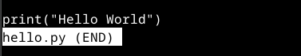
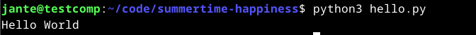
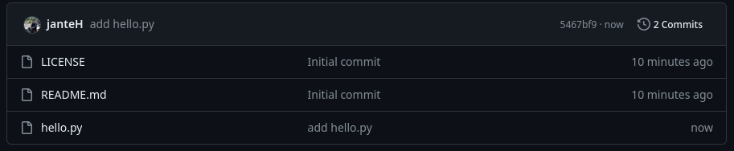
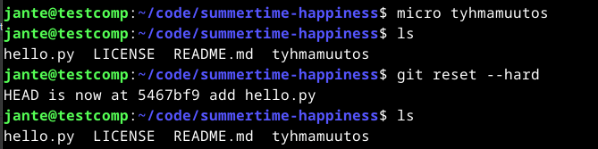
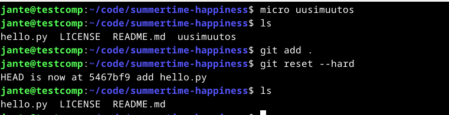
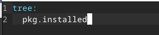
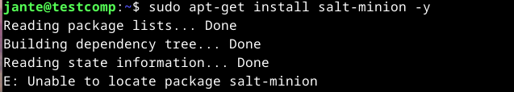
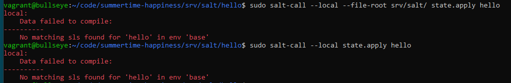
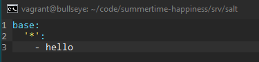
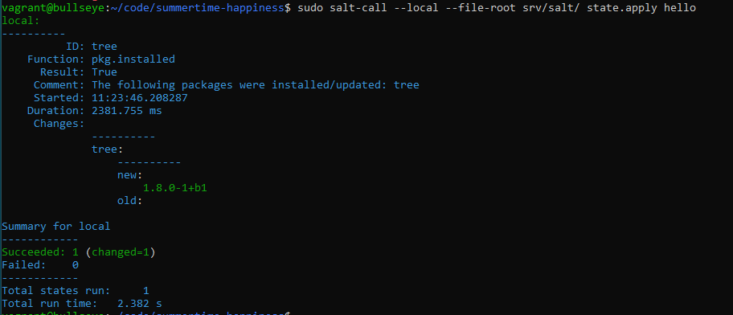

# x) Lue ja tiivistä

## Chacon and Straub 2014

- Git eroaa muista versionhallintatyökaluista
- Suurin ero on siinä, miten Git ajattelee tietoa
- Git käyttää paikallisia tieodstoja, ei verkon yli tiedostoja, mikä tekee Gitistä nopean
- Git tunnistaa kaikki muutokset
- Gitillä lisätään dataa tietokantaan
- Gitillä ei voi saada tietoja rikki, koska edellinen versio on aina palautettavissa

###### Lähteet:

Pro Git. Luettavissa: https://git-scm.com/book/en/v2. Luettu: 13.4.2024.

Pro Git. Luettavissa: https://git-scm.com/book/en/v2/Getting-Started-What-is-Git%3F. Luettu: 13.4.2024.

## Gitin käyttö on lähinnä 'git add . && git commit; git pull && git push'

- Git add . lisää koko työhakemistoon muutokset
- Git commit tallenetaan muutokset jollakin kommentilla
- Git pull hakee kaikki muutokset tietokannasta
- Git push päivittää muutokset tietokantaan

###### Lähteet:

Git. Luettavissa: https://git-scm.com/docs/git-add. Luettu: 13.4.2024.

Git. Luettavissa: https://git-scm.com/docs/git-commit. Luettu: 13.4.2024.

Git. Luettavissa: https://git-scm.com/docs/git-pull. Luettu: 13.4.2024.

Git. Luettavissa: https://git-scm.com/docs/git-push. Luettu: 13.4.2024.

## Varaston terokarvinen/suolax/ historia, eli loki ja muutokset

- readme:n päivitys
- hello world modulen lisäys, jolla luodaan tiedosto
- makefilen lisäys
- saltilla paketin asennus
- lisätty paketteja asennukseen
- readmen päivitys

###### Lähteet:

https://github.com/terokarvinen/suolax.git

# a) Online

Loin uuden repositoryn Githubiin tätä tehtävää varten. Valitsin lisenssiksi GNU General Public License v3.0. Lisäsin repositoryyn readme tiedoston luonnin yhteydessä.

# b) Dolly

Kopioin kirjaston nyt koneelleni sijaintiin /home/jante/code komennolla:

    git clone git@github.com:janteH/summertime-happiness.git

Navigoin nyt kloonattuun kirjastoon paikallisesti, ja loin tiedoston hello.py, jossa sisältönä hello world tulostus.

    micro hello.py

Testasin vielä koneella ennen tietojen vientiä, että koodi toimii

    python3 hello.py

Koodi toimii, joten vein tiedosto nyt Githubiin komennolla:

    git add . && git commit; git pull && git push

# c) Doh!

Yritin testata "git reset --hard" komentoa mutta en ollut ihan varma, mitä tässä pitäisi tapahtua.

Lisäsin uuden tiedoston "tyhmamuutos", jonka jälkeen ajoin reset komennon.

Ajattelin, että kokeilin tätä varmasti väärin ja testasin vielä ajaa ensin "git add ." komennon, jonka jälkeen resetin uudelleen. Sain kuitenkin saman tuloksen.

Etsin tietoa Gitin dokumentaatiosta, kuinka resetin pitäisi toimia.

Päätin kokeilla ajaa "git pull" komennon tähän väliin. Sain ilmoituksen, että "already up to date". Ajoin seuraavaksi "ls" komennon, aj huommasin, että "tyhmamuutos" -tiedosto olikin nyt kadonnut.

Kokeilin nyt uudelleen lisätä uuden tiedoston, jonka jälkeen ajoin add komennon. Tämän jälkeen ajoin reset komennon, ja tiedosto oli poistunut.

# d) Tukki

Tässä osiossa tarkastelin kirjaston logeja.

Sain login näkyviin komennolla:

    git log --patch --colo | less -R

Logissa näkyi, että hello.py tiedosto on lisätty. Olin jo aikaisemmin päivittänyt git config tiedot, että logeissa näkyvät oma nimeni oikein. Komennot, joilla konffia muutettiin on:

    git config --global user.email "email@example.com"
    git config --global user.name "Käyttäjän nimi"

# e) Suolattu rakki

Loin kirjastoon sijainnin /srv/salt/hello/

    mkdir -p srv/salt/hello/

Navigoin tähän sijaintiin.

Loin tänne tiedoston microlla "init.sls". Kirjoitiin tiedoston sisällöksi:

Kokeilin ajaa tiedostoa:

    sudo salt-call --local state.apply hello

Sain kuitenkin ilmoituksen, että salt-call komentoa ei tunnisteta.

Unohdin asentaa saltin, joten eikun asentamaan.

    sudo apt-get -y install salt-minion

Jostakin syystä en saanut saltia asennettua koneelle.

Koitin googlettaa virhettä mutta en löytänyt ratkaisua tähän.

Päätin kokeilla luoda uuden virtuaalikoneen Vagrantilla.

Tähän sain saltin asennettua. Tämän jälkeen asensin Gitin.

Muutin tiedot konffitiedostoon (email ja nimi), loin ssh-keygenillä avaimen, asetin sen gittiin.

Loin kansion /code kotihakemistoon, johon kloonasin aikaisemmin luodun kirjaston. Navigoin nyt kirjastoon.

Testasin, että commit toimii Gittiin asti muokkaamalla readme tiedostoa.

Loin nyt kansiot /srv/salt/hello/, ja navigoin hello kansioon.

Tein kansioon tiedoston init.sls, ja sisällöksi saman kuin aikaisemmassa.

Koitin nyt ajaa tiedostoa mutta sain virheeksi:

Päätin katsoa mallia, mitä Teron "suolax" kirjastossa oli sisällä. Huomasin tiedoston top.sls, joka oli salt kansion sisällä. Päätin kokeilla tehdä samanlaisen tiedoston salt kansioon.

Kokeilin ajaa uudelleen komennon:

    sudo salt-call --local --file-root srv/salt/ state.apply hello

Tällä kertaa onnistuin:

Päivitin nyt tiedot gittiin:

    git add . && git commit; git pull && git push

Lisäsin vielä paketteja tiedostoon ja ajoin uudelleen saltilla. Sekin näytti toimivan, joten päivitin tiedot taas gittiin.

Kokeilin vielä luoda Makefilea, jolla voisi ajaa nuo saltin komennot mutta en keksinyt, miten ajaa tuo makefile.

###### Lähteet

Debian. Luettavissa: https://docs.saltproject.io/salt/install-guide/en/latest/topics/install-by-operating-system/debian.html#install-salt-on-debian-11-bullseye-amd64. Luettu: 13.4.2024.

Git. Luettavissa: https://git-scm.com/docs/git-reset. Luettu: 13.4.2024.

Github, terokarvinen. Luettavissa: https://github.com/terokarvinen/suolax. Luettu: 13.4.2024.

Hello Salt Infra-as-Code. Terokarvinen.com. Luettavissa: https://terokarvinen.com/2024/hello-salt-infra-as-code/. Luettu: 13.4.2024.

Infra as Code - Palvelinten hallinta 2024. Terokarvinen.com. Luettavissa: https://terokarvinen.com/2024/configuration-management-2024-spring/. Luettu: 13.4.2024.
