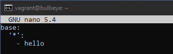

Raportti ja tehtävät aloitettu klo 11

# x) Lue ja tiivistä 

## Karvinen 2023: Salt Vagrant - automatically provision one master and two slaves

- Uusi tila luodaan kansioon esim sudo mkdir -p /srv/salt/hello
- Kansioon luodaan init.sls tiedosto sudoedit /srv/salt/hello/init.sls
- Top-tiedosto määrittää, mitkä tilat suoritetaan millekin minion koneelle

###### Lähteet

Infra as Code - Your wishes as a text file. Terokarvinen.com. Luettavissa: https://terokarvinen.com/2023/salt-vagrant/#infra-as-code---your-wishes-as-a-text-file. Luettu 20.4.2024.

top.sls - What Slave Runs What States. Terokarvinen.com. Luettavissa: https://terokarvinen.com/2023/salt-vagrant/#infra-as-code---your-wishes-as-a-text-file. Luettu 20.4.2024.

## Salt contributors: Salt overview

- Tiedostot renderöidään saltille YAML:lla
- YAML on merkintäkieli, joka muuttaa datan pythoniksi saltille
- Kolme peruselementtiä on Scalars, Lists, Dictionaries
- Yaml koostuu lohkorakenteista
- Sisennyksissä käytetään yleensä kahta välilyöntiä
- Listat tehdään "- " merkillä

###### Lähteet

Rules of YAML. Luettavissa: https://docs.saltproject.io/salt/user-guide/en/latest/topics/overview.html#rules-of-yaml. Luettu: 20.4.2024.

YAML simple structure. Luettavissa: https://docs.saltproject.io/salt/user-guide/en/latest/topics/overview.html#yaml-simple-structure. Luettu: 20.4.2024.

Lists and dictionaries - YAML block structures. Luettavissa: https://docs.saltproject.io/salt/user-guide/en/latest/topics/overview.html#lists-and-dictionaries-yaml-block-structures. Luettu: 20.4.2024.

## Karvinen 2018: Pkg-File-Service – Control Daemons with Salt – Change SSH Server Port

- Demoneita voi hallita pkg file servicellä
- asenna ohjelmisto, vaihda asetustiedosto ja lopuksi käynnistä demoni uudelleen käyttääksesi uutta kokoonpanoa
- Esimerkissä luodaan salt master-slave arkkitehtuuria käyttäen SSH State
- pääkoneelle luodaan tila (sshd.sls) ja määritystiedoston pääkopio (sshd_config)

###### Lähde

Pkg-File-Service – Control Daemons with Salt – Change SSH Server Port. Terokarvinen.com. Luettavissa: https://terokarvinen.com/2018/04/03/pkg-file-service-control-daemons-with-salt-change-ssh-server-port/?fromSearch=karvinen%20salt%20ssh. Luettu: 20.4.2024.

### OS koneen speksit löytyvät projektin readme tiedostosta: https://github.com/janteH/server-management-course/blob/main/README.md

Avasin komentokehotteen adminina ja loin uuden vagrant virtuaalikoneen.

Windowslogo + R (avaa "Windows run" ohjelman).

"cmd" -> shirft+control+enter (avaa komentokehotteen adminina).

    vagrant init debian/bullseye64

    vagrant up

    vagrant ssh

Päivitin koneelle ensin paketit

    sudo apt-get update

Asensin salt minionin

    sudo apt-get install salt-minion

# a) Hello SLS!

Tee Hei maailma -tila kirjoittamalla se tekstitiedostoon, esim /srv/salt/hello/init.sls.

Aloitin luomalla kansiot

    sudo mkdir -p /srv/salt/hello

Tein init.sls tiedoston kansioon

    sudoedit /srv/salt/hello/init.sls

tiedostoon sisällöksi

    /tmp/hei-maailma:
      file.managed

Ajoin tämän tilan komennolla

    sudo salt-call --local state.apply hello

Uusi tiedosto luotiin koneelle:

# b) Top

Tee top.sls niin, että useita valitsemiasi tiloja ajetaan automaattisesti, esim komennolla "sudo salt '*' state.apply" tai "sudo salt-call --local state.apply".

Tein top tiedoston komennolla

    sudoedit /srv/salt/top.sls

Tiedoston sisällöksi 

    base:
      '*':
        - hello

Testasin nyt ajaa tämän komennolla

    sudo salt-call --local state.apply

Tiloja ei tarvinnut nyt kirjoittaa erikseen, sillä ne lukevat top.sls tiedostossa.

Komento toimi, joten päätin luoda uuden tilan ajettavaksi top-tiedostosta.

Uusi kansio:

    sudo mkdir -p /srv/salt/packages

Tänne uusi tiedosto:

    sudoedit /srv/salt/packages/init.sls

Tiedoston sisällöksi:

    my-packages:
      pkg.installed:
        - pkgs:
          - tree
          - micro
          - curl
          - git

Editoin top tiedostoon uuden tilan

    sudoedit /srv/salt/top.sls

Sitten ajoin tilat uudelleen

    sudo salt-call --local state.apply

Sain virheeksi:

Päätin tarkistella tiedostoa packages/init.sls

    sudoedit /srv/salt/packages/init.sls

Täältä löytyi kirjoitusvirhe (sisennykset paketeista), jonka korjasin:

Ajoin nyt uudelleen 

    sudo salt-call --local state.apply

Ja paketit asentuivat nätisti.

Kokeilin vielä ajaa komennon uudelleen ja lyhentää tulosta, niin saan tiivistetyn kuvankaappauksen raporttiin

    sudo salt-call --local --state-output=terse state.apply

# c) Apache easy mode

Asenna Apache, korvaa sen testisivu ja varmista, että demoni käynnistyy.

- Ensin käsin, vasta sitten automaattisesti.
- Kirjoita tila sls-tiedostoon.
- pkg-file-service
- Tässä ei tarvita service:ssä watch, koska index.html ei ole asetustiedosto

Asensin apachen ensin käsin

    sudo apt-get install apache2 -y

Tein kansion uudelle apache sivulle

    mkdir -p /publicsite/jante.com

Kansioon uusi tiedosto

    micro index.html

Loin uudet konffi tiedoston sijaintiin /etc/apache2/sites-available

    sudoedit jante.com.conf

Tiedostoon:

    <VirtualHost *:80>
     ServerName jante.com
     ServerAlias www.jante.com
     DocumentRoot /home/vagrant/publicsite/jante.com
     <Directory /home/vagrant/publicsite/jante.com>
       Require all granted
     </Directory>
    </VirtualHost>

Oletussivun disablointi

    sudo a2dissite 000-default.conf

Ja oman sivun enabloitni

    sudo a2ensite jante.com.conf

Apachen uudelleen käynnistys

    sudo systemctl restart apache2

Sitten testasin mitä localhost näyttää

    curl localhost

Seuraavaksi automatisoidaan apachen asennus.

Uusi tila 

    sudo mkdir -p /srv/salt/apache

Kansioon tiedosto

    sudoedit /srv/salt/apache/init.sls

Tiedoston sisällöksi

    apache2:
      pkg.installed

Top tiedoston muokkaus

    sudoedit /srv/salt/top.sls

Tilojen ajaminen testiksi

    sudo salt-call --local --state-output=terse state.apply

Kaikki toimii kuten pitää.

Muokkaan vielä init tiedostoon lisää tietoja

    sudoedit /srv/salt/apache/init.sls

    /etc/apache2/sites-available/jante.com.conf:
      file.managed
      
    /etc/apache2/sites-enabled/jante.com.conf:
      file.symlink:
        - target: "../sites-available/jante.com.conf"
    
    apache2.service
      service.running

Tilojen ajaminen testiksi

    sudo salt-call --local --state-output=terse state.apply

# d) SSHouto

Lisää uusi portti, jossa SSHd kuuntelee.

- Jos käytät Vagrantia, muista jättää portti 22/tcp auki - se on oma yhteytesi koneeseen. SSHd:n asetustiedostoon voi tehdä yksinkertaisesti kaksi "Port" riviä, molemmat portit avataan.
- Löydät oikean asetuksen katsomalla SSH:n asetustiedostoa
- Nyt tarvitaan service-watch, jotta demoni käynnistetään uudelleen, jos asetustiedosto muuttuu masterilla

Aloitin luomalla uuden kansion tilalle

    sudo mkdir -p /srv/salt/sshd

Tänne tiedosto

    sudoedit /srv/salt/sshd/sshd.sls

Tiedostoon:

    openssh-server:
      pkg.installed
    
    /etc/ssh/sshd_config:
      file.managed:
        - source: "salt://sshd_config"
     
    sshd:
      service.running:
        - watch:
          - file: "/etc/ssh/sshd_config"

Muokataan top tiedostoon uusi tila

Kokeilin nyt ajaa tilat uudelleen

    sudo salt-call --local state.apply

Sain kuitenkin virheen

Tehtävien teko lopetettu klo 14.

###### Lähteet

Infra as Code - Palvelinten hallinta 2024. Terokarvinen.com. Luettavissa: https://terokarvinen.com/2024/configuration-management-2024-spring/. Luettu: 20.4.2024.

Install Salt on Debian 11 (Bullseye) amd64. Luettavissa: https://docs.saltproject.io/salt/install-guide/en/latest/topics/install-by-operating-system/debian.html#install-salt-on-debian-11-bullseye-amd64. Luettu: 20.4.2024.

