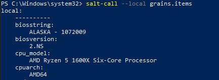
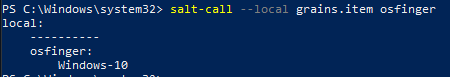
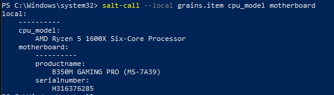
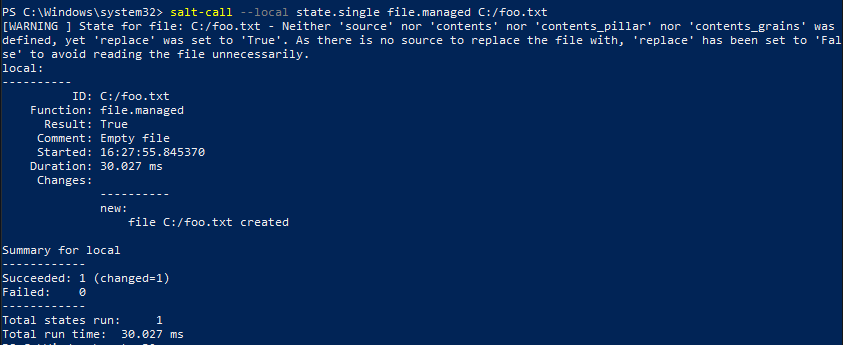
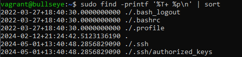
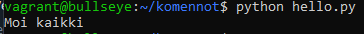

# x) Lue ja tiivistä

## Using Salt with Windows

- Aloitus init.sls tiedoston luonnista
- salt-call komennon ajo
- windows tietojen keruu ja tallennus txt tiedostoon
- tnc komennolla porttien yhdistäminen

###### Lähde

Using Salt with Windows. Tuomasvalkamo.com. Luettavissa: https://tuomasvalkamo.com/CMS-course/week-5/. Luettu: 1.5.2024.

# a) Asenna Salt Windowsille tai Macille

Olin jo asentanut saltin tietokoneelleni, joten tässä kohtaa testasin vain toimivuuden ajamalla komennon:

    salt-call --local grains.items

Sain pitkän listan OS koneeni tiedoista.

# b) Kerää Windows- tai Mac-koneesta tietoa grains.items -toiminnolla

Tässä tehtävässä tarkensin komentoon, mitä tietoja halutaan koneesta kerätä:

    salt-call --local grains.item osfinger

    salt-call --local grains.item cpu_model motherboard

# c) Kokeile Saltin file -toimintoa Windowsilla tai Macilla

Kokeilin komentoa:

    salt-call --local state.single file.managed C:/foo.txt

Tämä luo tiedoston C:n juureen nimeltä foo

# d) CSI Kerava. Näytä 'find' avulla viimeisimmäksi muokatut tiedostot /etc/-hakemistosta ja kotihakemistostasi

Avasin vagrant virtual linuxin, jossa ajoin komennon:

    sudo find -printf '%T+ %p\n' | sort

Avasin manuaalin find komennosta "man find". Komennon printf tulostaa tuloksen, %T näyttää ajan, %p näyttää tiedoston nimen, \n rivin vaihto ja sort lajittelee ajat järjestykseen.

# e) Komennus. Tee Salt-tila, joka asentaa järjestelmään uuden komennon

Asensin vagrant koneelle salt minionin:

    sudo apt-get install salt-minion -y

Loin kotihakemistoon kansion komennot, jonka sisään python tiedosto. Asensin myös pythonin virtuaalikoneelle:

    sudo apt-get install python -y

Menin kansioon /srv, johon tein uuden kansion salt ja komennot

Tänne kansioon kopioin python tiedoston ja poistin kotihakemistosta

Tein init.sls tiedoston ja koitin ajaa state.apply mutta sain virheilmoituksia ja tehtävä jäi kesken.

###### Lähteet

Infra as Code - Palvelinten hallinta 2024. Terokarvinen.com. Luettavissa: https://terokarvinen.com/2024/configuration-management-2024-spring/. Luettu: 1.5.2024.
