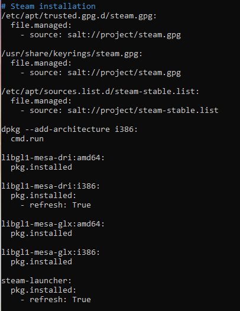

# Oma miniprojekti

Tarkoitus asentaa pelitapahtumassa käytettävät koneet.

Asennetaan Linux pohjaiselle koneelle sovellukset: Discord, Steam.

### Lisenssi

GNU General Public License, versio 3

# Asennusohje

### Esivalmistelut

Ensin Host koneelle Vagrantin asennus: https://developer.hashicorp.com/vagrant/install

Kahden virtuaalikoneen asennus: https://github.com/janteH/server-management-course/blob/main/h2/soitto-kotiin.md#a-asenna-kaksi-virtuaalikonetta-samaan-verkkoon

Saltin asennus virtuaalikoneille: https://github.com/janteH/server-management-course/blob/main/h2/soitto-kotiin.md#b-asenna-saltin-herra-orja-arkkitehtuuri-toimimaan-verkon-yli

Master koneella init.sls tiedoston luonti kansioon /srv/salt/project - Tähän tiedostoon tulee minion koneelle asennettavat ohjelmat

### Discord asennus

https://www.linuxcapable.com/how-to-install-discord-on-debian-linux/

Paketin nouto

    wget "https://discord.com/api/download?platform=linux&format=deb" -O discord.deb

Asennus

    sudo apt install ./discord.deb

Kopioidaan tiedosto discord.deb project kansioon, muokataan init.sls tiedostoon tarvittavat asennuskomennot

### Steam asennus

https://repo.steampowered.com/steam/

Paketin lataus sivulta ja sen vienti virtuaalikoneen kansioon /usr/share/keyrings/

Ohjeen mukaiset komennot:

    sudo tee /etc/apt/sources.list.d/steam-stable.list <<'EOF'
    deb [arch=amd64,i386 signed-by=/usr/share/keyrings/steam.gpg] https://repo.steampowered.com/steam/ stable steam
    deb-src [arch=amd64,i386 signed-by=/usr/share/keyrings/steam.gpg] https://repo.steampowered.com/steam/ stable steam
    EOF

    sudo dpkg --add-architecture i386
    sudo apt-get update
    sudo apt-get install \
    libgl1-mesa-dri:amd64 \
    libgl1-mesa-dri:i386 \
    libgl1-mesa-glx:amd64 \
    libgl1-mesa-glx:i386 \
    steam-launcher

Projekti kansioon kopiointi:

    sudo cp /etc/apt/sources.list.d/steam-stable.list /srv/salt/project
    
    sudo cp /etc/apt/trusted.gpg.d/steam.gpg /srv/salt/project

Init.sls tiedostoon muokkaus:

### init.sls tiedoston ajo minion koneille

    sudo salt '*' state.apply project

